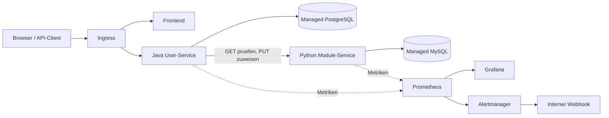

# Deine muendliche Pruefung: das eigene Projekt erklaeren

## Einstieg in 60 Sekunden

> Meine Anwendung besteht aus einem Frontend, einem Java-User-Service und einem
> Python-Module-Service. Sie laufen als Container in Kubernetes bei DigitalOcean.
> Der User-Service speichert Benutzer in Managed PostgreSQL. Der Module-Service
> verwaltet Module und Zuweisungen in Managed MySQL. Die Dienste sprechen ueber
> HTTP miteinander. Terraform verwaltet die Cloud-Ressourcen, Helm beschreibt
> die Kubernetes-Anwendung und Argo CD gleicht den Cluster mit Git ab.
> Prometheus sammelt Messwerte; Grafana stellt sie dar. Mit Last- und Ausfalltests
> habe ich Skalierung, Verfuegbarkeit und Fehlerbehandlung geprueft.

## Die sechs Themen

**1. Observability: Was passiert in meiner Anwendung?**

Prometheus ruft regelmaessig Metrik-Endpunkte ab. Ein ServiceMonitor beschreibt,
welchen Kubernetes-Service der Prometheus Operator dafuer einrichten soll.
Grafana fragt die gespeicherten Zeitreihen ab und zeichnet Diagramme.
Unsere drei Dashboards zeigen CPU/RAM/HPA, den User-Service und den Module-Service.
RED bedeutet **Rate** (Anfragen pro Sekunde), **Errors** (Fehleranteil) und
**Duration** (Antwortdauer). Bei der geplanten Backend-Wartung wurden ein Alarm
und nach der Erholung eine Entwarnung an unseren internen Webhook zugestellt.
Metriken sind aggregierte Messwerte; Logs beschreiben einzelne Ereignisse.
Verteiltes Tracing ist in diesem Projekt nicht eingerichtet.

**2. Lasttest und HPA: Was passiert bei mehr Benutzern?**

k6 hat fuenf Minuten lang echte Login-Anfragen mit bis zu 20 virtuellen Benutzern
gesendet. Ergebnis: **3282 erfolgreiche Logins, 0 Fehler, P95 1.06 Sekunden**.
P95 bedeutet: 95 Prozent der gemessenen Anfragen waren hoechstens so langsam.
Es ist weder der Durchschnitt noch der langsamste Request.

Der HPA skalierte das Backend **1 -> 2 -> 1**. Er vergleicht die durchschnittliche
CPU-Auslastung mit dem Zielwert: bei uns 60 Prozent von 250m CPU-Request, also
150m pro Pod. 1000m entspricht einem CPU-Kern. Kubernetes-Metrics-Server liefert
die CPU-Werte fuer diesen HPA; Grafana loest die Skalierung nicht aus.
Mehr Pods sind horizontale Skalierung; mehr CPU/RAM je Pod ist vertikale Skalierung.
Die zwei Worker-Nodes sind die Maschinen, auf denen diese Pods laufen.

**3. Terraform: Wie wird Infrastruktur reproduzierbar?**

Ich beschreibe den gewuenschten Zustand in HCL-Dateien. Der DigitalOcean-Provider
uebersetzt die benoetigten Aenderungen in API-Aufrufe. `init` installiert Provider,
`plan` zeigt geplante Aenderungen, `apply` fuehrt sie aus. Terraform ist kein
allgemeiner Assistent, der beliebige Ziele wie eine YouTube-Suche ausfuehrt.

Unser bestehender Kubernetes-Cluster wurde importiert. Dadurch wurde er Terraform
zugeordnet und nicht neu erstellt. Der State speichert diese Zuordnung und weitere
Ressourceninformationen. Er kann Geheimnisse enthalten und gehoert bei uns nicht
ins Git-Repository. Importierte Konfiguration wurde bereinigt und parametrisiert;
ein anschliessender Plan zeigte keine Aenderungen.

**4. Managed PostgreSQL: Wie wurde sicher migriert?**

Der Anbieter betreibt den Datenbankdienst; wir verantworten weiterhin Daten,
Zugriffsrechte, Verbindung und die korrekte Migration unserer Anwendung.
Wir stoppten Staging-Schreibzugriffe, erstellten ein aktuelles Backup, stellten es
im Managed-Ziel wieder her und verglichen Tabellen/Sequenzen mit Fingerprints.
Nach Umschaltung wurden echte JDBC-Verbindungen mit TLS und Funktionstests geprueft.
Erst danach wurden alte Staging-DB und Volume entfernt. Production blieb separat.

Nach dem Restore fehlten Planerstatistiken. `ANALYZE` half PostgreSQL, passende
Abfrageplaene zu waehlen. Fuenf parallele Modulzuweisungen dauerten anschliessend
0.11-0.25 s statt in ein 10-s-Client-Timeout zu laufen. ANALYZE kopiert keine
Anwendungsdaten und ersetzt keinen Restore.

**5. Policy as Code: Welche Regeln muessen Deployments erfuellen?**

Kyverno prueft Kubernetes-Objekte bei der Aufnahme in den Cluster. Unsere drei
Enforce-Policies verlangen Ressourcen-Requests/Limits, sicheren Non-root-Betrieb
und explizite Image-Tags statt `latest`. Ein ungueltiges Deployment wird abgelehnt.
Zwoelf Gegenproben pruefen auch Init-Container und Root-Overrides. Die Regeln
gelten fuer das entsprechend markierte Staging, nicht pauschal fuer alle Namespaces.
Requests dienen der Platzierung/Reservierung; Limits begrenzen die Nutzung.
Ein CPU-Limit kann drosseln, ein ueberschrittenes RAM-Limit kann zum OOMKill fuehren.

**6. Microservices: Wie wird ein Modul zugewiesen?**

1. Ein angemeldeter Benutzer ruft `PUT /users/{userId}/modules/{moduleId}` auf.
2. Das Backend prueft Berechtigung und Existenz des Benutzers.
3. Ein GET beim Module-Service prueft, ob das Modul existiert.
4. Ein PUT beim Module-Service legt die Zuweisung in MySQL an.
5. Erfolg liefert HTTP 204; erneutes Zuweisen ist idempotent, erzeugt also kein Duplikat.

Der User-Service greift nicht direkt auf MySQL zu. Jeder Dienst besitzt seine
Daten und bietet anderen Diensten seine API an. Fehlendes Modul: 404; ungueltige
UUID: 400; fehlende Berechtigung: 403; voruebergehend unerreichbarer Module-Service: 503.
Ueber unseren Ingress steht vor der Route noch `/api`.

## Timeout, Retry und Circuit Breaker unterscheiden

- **Timeout:** begrenzt das Warten auf einen einzelnen Versuch; hier 1 s fuer
  Verbindungsaufbau und 2 s fuer die HTTP-Anfrage.
- **Retry:** wiederholt einen voruebergehenden Fehler; maximal 3 Versuche mit
  200 ms Abstand. Kein Retry bei 404. Wiederholungen sind hier wegen GET und
  idempotentem PUT vorgesehen; beliebige Schreiboperationen darf man nicht blind wiederholen.
- **Circuit Breaker:** schuetzt vor dauernden Aufrufen einer gestoerten Abhaengigkeit.
  Nach mindestens 5 logischen Aufrufen und mindestens 50 Prozent Fehlern oeffnet
  er. Nach 15 s erlaubt er zwei Proben; erfolgreiche Proben schliessen ihn wieder.

Live sahen wir beim Netzwerkausfall 503 nach 3.47-4.46 s. Der offene Breaker lieferte
weitere 503 in 29-46 ms, auch kurz nach Reparatur der Verbindung. Der Module-Counter
stieg dabei nicht: Es wurde wirklich kein neuer Downstream-Aufruf gesendet.
Login blieb erfolgreich. Danach funktionierten Zuweisungen wieder mit 204.
Ein Breaker ist lokal im jeweiligen Backend-Prozess; bei zwei Pods hat jeder seinen eigenen Zustand.

## CI/CD und GitOps in einem Satz

GitHub Actions testet den Anwendungscode, baut drei Images mit Commit-SHA-Tags
und aktualisiert die Staging-Tags im Ops-Repository. Argo CD erkennt diese
Git-Aenderung und synchronisiert die Helm-Konfiguration in den Cluster.
Eine erfolgreiche Pipeline allein beweist noch keinen gesunden Betrieb; deshalb
pruefen wir zusaetzlich Rollout, Readiness und echte Anfragen.

## Zwei Fehler, die du erklaeren koennen solltest

**Erster Lasttest fehlgeschlagen:** Der Java-Heap war automatisch nur etwa 128 MiB
gross. Parallele Argon2-Passwortpruefungen erschoepften ihn; danach scheiterten
Probes und Pods starteten neu. Wir begrenzten die Parallelitaet, setzten den Heap
explizit auf maximal 256 MiB und passten CPU, Probes und HPA an. Der zweite Test
bestand. Ein Java-Heapfehler ist nicht automatisch dasselbe wie ein OOMKill des Containers.

**Falscher Fehlerstatus:** Ein fehlendes Modul lieferte zuerst 403 statt 404,
weil Spring den internen Error-Dispatch erneut authentifizierte. Der interne
ERROR-Dispatch ist nun erlaubt; normale API-Aufrufe bleiben geschuetzt.
HTTP-Regressionstests und der Live-E2E bestaetigen das Verhalten.

## Fuenf Minuten Demo vorbereiten

1. README und Architektur zeigen, beide Repositories nennen.
2. In Grafana die drei VSC-Dashboards und das gespeicherte Lasttestdiagramm erklaeren.
3. Den erfolgreichen k6-Nachweis und HPA 1 -> 2 -> 1 zeigen.
4. Terraform-Konfiguration, drei Kyverno-Policies und den Module-Client zeigen.
5. Den Ausfallnachweis erklaeren. Fuer die Pruefung reicht der gespeicherte Nachweis,
   sofern die Lehrperson keine erneute Live-Demo verlangt.

Grenzen ehrlich nennen: kleine Kursumgebung, Kyverno mit einer Admission-Replik,
ephemere Monitoring-Daten, getestetes Lastprofil statt allgemeiner Kapazitaetsgarantie.
Die dauerhaften Nachweise liegen in `evidence/`.
