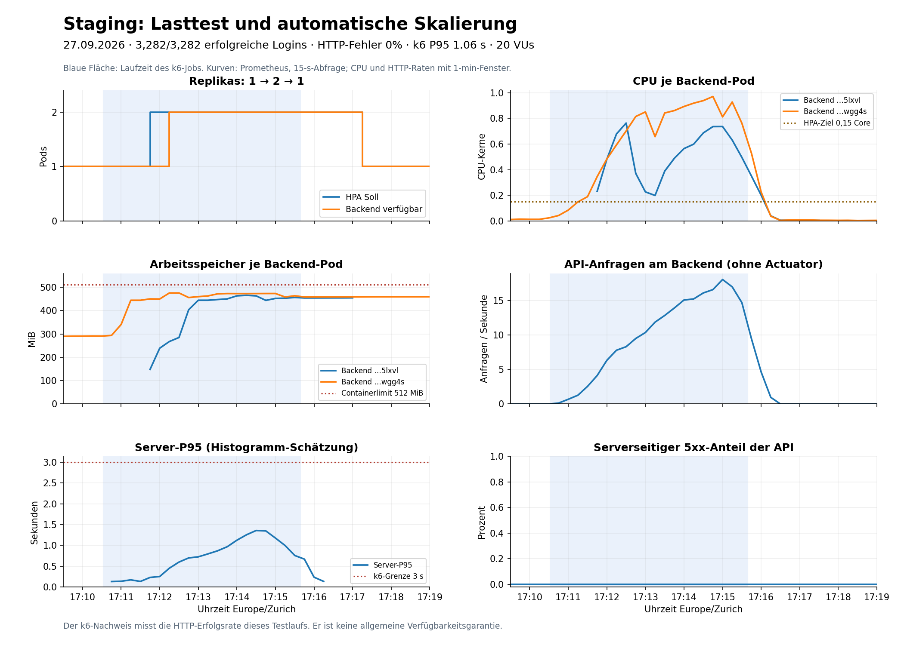

# Aufgabe 2: Lasttest nach Korrektur bestanden

27.09.2026, Europe/Zurich. Der erste fehlgeschlagene Lauf und seine Ursache bleiben
unter [loadtest-first-run.md](loadtest-first-run.md) dokumentiert.

## Ergebnis

| Messwert | Wiederholung |
|---|---:|
| Reale API-Anfragen: POST /users/login | 3282 |
| Erfolgreiche Anmeldungen | 3282 / 3282 (100%) |
| HTTP-Fehler | 0 (0%) |
| Unterbrochene Iterationen | 0 |
| Mittlere HTTP-Antwortzeit | 383.04 ms |
| HTTP-P95, auch nur erfolgreiche Antworten | 1.06 s |
| Maximale HTTP-Antwortzeit | 2.82 s |
| Durchschnittlicher Durchsatz | 10.934379 Anfragen/s |
| Virtuelle Benutzer | Rampe 2 -> 10 -> 20 -> 0 |
| Alle vier k6-Grenzwerte | Bestanden |

Der Test verwendet den Login-Endpunkt mit Argon2-Passwortpruefung und Managed
PostgreSQL. Die Ergebnisse beziehen sich auf den fuenfminuetigen Lauf mit bis zu 20 VUs.

## Zeitlicher Nachweis von Scale-out und Scale-in

| Uhrzeit | Beobachtung |
|---|---|
| 17:08:49-17:09:37 | Baseline: ein Ready-Backend, null Restarts, HPA current=desired=1 |
| 17:10:32 | Kubernetes-Job gestartet |
| 17:10:33 | k6-Container gestartet |
| 17:11:29 | HPA-Event: New size: 2; CPU-Auslastung ueber Ziel |
| 17:12:15 | Prometheus zeigt zwei verfuegbare Backend-Replikas |
| 17:15:36 | k6-Container erfolgreich beendet, Exitcode 0 |
| 17:15:39 | Job Complete, succeeded=1 |
| 17:17:00 | HPA-Event: New size: 1; alle Metriken unter Ziel |
| 17:17:15 | Prometheus bestaetigt HPA-Soll=1 und eine verfuegbare Replica |

HPA-Events sind direkte Ereigniszeitpunkte. Prometheus-Zeitpunkte stammen aus
15-Sekunden-Abfragen und koennen daher leicht nachlaufen. Im exportierten Fenster
17:09:30-17:19:00 liegt die Zahl verfuegbarer Backends immer zwischen eins und zwei.
Beide Backends haben durchgehend null Restarts und null Container-OOM-Ereignisse.

CPU-Spitzen (1-Minuten-Rate): ca. 0.97 bzw. 0.76 Cores. Memory-Spitzen:
ca. 475.7 bzw. 465.4 MiB, unter dem jeweiligen 512-MiB-Limit. Die Kapazitaet
reicht fuer den getesteten Kurs-Workload; die RAM-Reserve bleibt begrenzt.



Das Bild wurde aus den gespeicherten Prometheus-Daten erzeugt. Server-P95 ist eine
Histogramm-Schaetzung pro Zeitfenster; der oben genannte k6-P95 stammt direkt aus
allen gemessenen Client-Anfragen. Beide Werte muessen deshalb nicht identisch sein.

## Identitaet und reproduzierbare Dateien

- Cluster-Kontext: `do-fra1-vsc-orchestrierung`; Namespace: `user-mgmt-staging`.
- Application-Image: `fd1e6343585fdf92ba437e929d23cabe1f894133`.
- Ops-main beim Test: `b8bd1dedc903cec87cbc1ca3e8cb3f7104c1bd9a` (PR 5).
- Job: `user-mgmt-loadtest`; UID: `de4600bc-69ba-46b0-b6d7-dce124623110`.
- k6-Pod: `user-mgmt-loadtest-f927v`; grafana/k6:1.2.3.
- [Originale k6-Zusammenfassung](loadtest-retry-metrics.k6.txt).
- [Prometheus-Abfragen und Messwerte](loadtest-retry-metrics.json), ohne Geheimnisse.

Solange der beendete Job und die Prometheus-Historie vorhanden sind:

```powershell
python scripts/collect-loadtest-metrics.py --start "2026-09-27T15:09:30Z" --end "2026-09-27T15:19:00Z" --output evidence/loadtest-retry-metrics.json
```

Das Diagramm kann jederzeit offline aus der eingecheckten JSON-Datei reproduziert
werden (Python mit matplotlib 3.10.7 und tzdata):

```powershell
python scripts/plot-loadtest-metrics.py evidence/loadtest-retry-metrics.json evidence/loadtest-retry.png
```

## Grafana und RED-Metriken

Die drei provisionierten Dashboards wurden nach der Korrektur ueber die Grafana-API
ausgelesen: Infrastruktur mit vier Panels, User-Service und Module-Service mit je
drei Panels. Alle zehn exakten PromQL-Abfragen lieferten fuer 17:06-17:19 Uhr
reale, endliche Messwerte. Die Module-Metriken stammen in diesem Fenster aus dem
vorangegangenen E2E-Test; der k6-Lauf belastet den Login, nicht den Module-Service.

Die Replica-Legenden zeigen jetzt Deployment/HPA statt des exportierenden
kube-state-metrics-Pods. Beide Fehlerquoten zeigen null, wenn die Request-Metrik
vorhanden ist, aber noch keine 5xx-Serie existiert. Fehlt die komplette Request-
Metrik, wird weiterhin kein Wert erfunden. Der Generator und die drei ConfigMaps
sind versioniert; die aktualisierten ConfigMaps wurden live angewendet.

Spring Security verarbeitet den Login vor dem MVC-Controller und liefert deshalb
`uri="UNKNOWN"`. Die RED-Abfragen schliessen nur Actuator aus und erfassen somit
auch diese Logins. Ein Filter ausschliesslich auf `uri="/users/login"` wuerde
die Messungen faelschlich ausblenden. Diese Eigenschaft ist bewusst dokumentiert.

Die Dashboards wurden ueber die Grafana-API und ihre PromQL-Abfragen geprueft.
Das Diagramm wurde aus den gespeicherten Prometheus-Messwerten erstellt.
